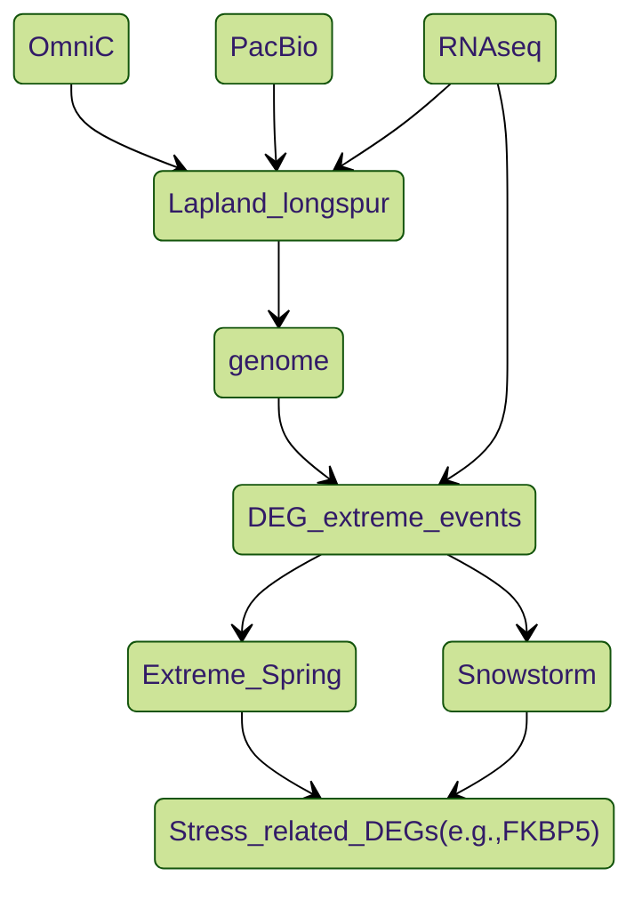

# LALO Plots and scripts
Date: 18/09/2024

Author: *Zhou Wu* (Institute: The Roslin institute, University of Edinburgh, UK)

The scripts used to create plots in the LALO genome and stress transcriptomic paper.

## Graphic abstract

  

## Pipeline

